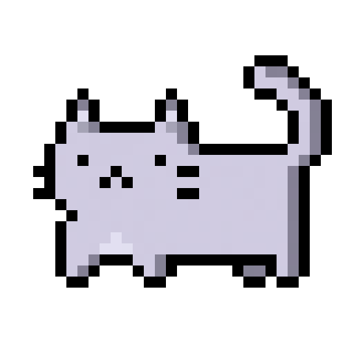

  
  <h1>Hi I'm Aiden 👋</h1>
  
  
  
  
   
   
  
  
  
  
  

## About me

Hey, I’m Aiden. I’m a Computer Science student in the Oklahoma State University Honors College, graduating in 2026. I build web apps, audio tools, AI projects, and games, with a particular interest in software engineering, audio programming, and creative work.

Outside of software, I’m a performer, composer, and producer. I perform with the OSU Jazz Band and Resistance Indoor Percussion, and I record, mix, and master my own music.

## What I like building

- Web apps that are clean, easy and fun to use
- Audio software for making and shaping sound
- Interactive websites with a mix of software and art

## Take me to a random website!

  
  

---

  
   
  Always making something.

